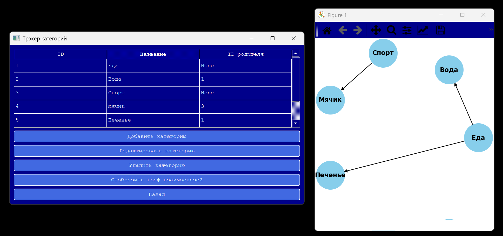

# Hello!

This is a **home accounting application**, created as a coursework assignment at the MIPT.  
The goal of the project was to **learn SQLite properly**, implement testing, and create reports based on financial data.  

> Note: The name is intentionally misspelled 😉

## Overview
The application is essentially **a SQLite database with a Python wrapper**, providing a graphical interface.  
Through the GUI, you can:  
- Add, edit, and delete expenses and expense categories  
- View statistics and reports  

## Requirements
- Python 3.10  
- PySide6  
- Numpy  
- sqlite3 (built-in)  
- Standard Python libraries: abc, typing, itertools, dataclasses  

A video demonstrating usage is included in the root directory.
Also the screenshot of unreal design is there:



## How to Run
Run the application via:  
```bash
python bookkeeper/simple-client.py


